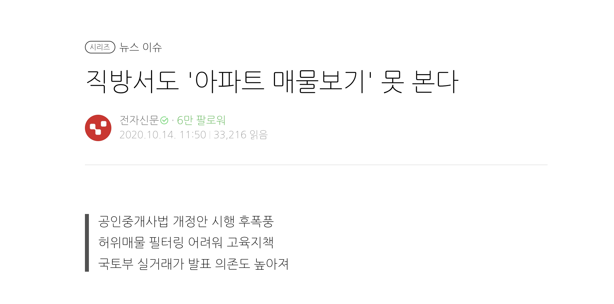

# 직방 역기획으로 본 개선안 방향 도출

직방 역기획 및 서비스 및 UXUI 개선안을 위해 도출해본 문서이며 
직방 관련 강의를 들으며 연습을 위해서 작성한 자료입니다. 
(아래부터는 ~다 체로 진행)

직방에는 아파트, 빌라, 원룸, 오피스텔 단위로 나뉘어져 있는데 이 역기획에서는 아파트라는 기능묶음 단위를 분석하였다.

# 서비스 소개   

   

 홈화면에서는 프로덕트 포탈 외에는 아무런 기능을 제공하지 않는다. 부동산 정보에 대한 신뢰성을 나타낼 수도 있고, 프로덕트간 교차가 없어 나뉘어 논 것일 수도 있다. 그리고 이 화면의 문제점은 홈화면이 몇년간 바뀌지 않아서 생동감을 주지 않는다.

 또한 알림이 너무 많이온다. 특히 아파트마다 중복적으로 오는 푸시는 사용자에게 하여금 피로도를 높일 수 있다. 

  
위 사진에서는 잘 안보이지만 매매/전월세 & 신축분양 & 인구흐름에 따라 UI 다르게 제공하고 있다. 

  
분양 관련 컨텐츠는 채용공고를 살펴본 결과 직방에서 직접 컨텐츠를 제작해서 작성하는 듯하다. 

한가지 특이점은 분양리스트는 진행상태에 따라 리스트이 되는데 긴급도 순이 아니라 분양을 준비할 수 있는 시간까지 고려되어 분양 임박률이 설정되는 것이 특이했다. 이외에 메인에서는 분양가가 기본으로 뜨며 세부정보에서는 경쟁률이 기본으로 뜨는 것이 특이점으로 있었다. 

 

# 직방 비전과 비즈니스 전략
직방의 미션과 비전은 "직방은 사람들이 원하는 집을 쉽고 빠르게 구할 수 있도록 돕고 주거 환경이 더욱 나아지도록 만들고자 합니다." >> 직방은 부동산 서비스와 우리집 서비스를 통해서 단순 매물 조회 서비스가 아닌 통합적인 주거플랫폼을 만드려고 한다는 것을 알 수 있다. 

직방의 주 사업은 부동산 서비스인데, 아파트 신축분양 서비스, 3D 단지투어 서비스, 청년 중개 사관학교, 중개 라이브를 하고 있다.

  
온라인 환경에서 집을 구할 때 가장 불편한 점은 사진으로만 집을 볼 수 있으며 그러다보니 실제로 보러가면 실망한다는 것인데 3D투어와 온라인 중개서비스로 시공간적 제약에서 조금 더 벗어나 더 많은 매물을 보고 비교해볼 수 있는 것이 좋았다. 

주거 플랫폼으로 거듭나고자 우리집 서비스를 제공하고 있는데 주된 내용은 아파트 관리에 필요한 서비스와 주민간의 커뮤니티 및 IoT기술을 활용하여 집 컨트롤을 휴대폰으로 가능하게 한 것을 들 수 있다. (아파트 관리사무소에 판매하기 위한, 부수입 및 주민 편의를 위해 도입한 서비스로 보인다.)

  
청년중개사관학교를 수료하면 직방의 온택트파트너스와 제휴를 맺고 ‘온택트중개사‘로 활동할 수 있는데 청년 취업에도 도움이 되고, 또 경험을 중시하는 보수적인 공인중개사 사회에서 청년이 나아갈 수 있는 방향도 고려했다.

그 외의 관점에서 보면 현재 공인중개사협회와 많은 갈등을 겪고 있는 직방이 중개인들의 풀을 넓히기 위해 이런 사업을 시작했을 수도 있다는 생각이 든다.

# 직방의 수익구조와 수익극대화 방안
원룸, 오피스텔, 빌라/투룸 광고의 경우 배너 위치와 개수에 따라 광고비를 중개사에서 과금시키는 방안이며 대부분의 플랫폼들이 이런 방식으로 수익을 가져간다. 또한 사용자 행동패턴에 맞춘 광고 요금 제도도 있는데 원룸의 지하철역 배너, 오피스텔 단지의 배너가 있다.

수익극대화 방안으로는 안정적인 원룸투룸 광고로 수익 개선, 아파트 중개와 광고로 수익 피봇팅, IoT 기술을 활용한 스마트홈 추가 수익 확보가 있다.

 
 
아파트 정보를 공유하는 다양한 플랫폼이 있지만 아파트 매물을 확인하고 중개사와 연결이 되는 플랫폼은 네이버 부동산밖에 없었다. 직방이 나아가야할 방향은 아파트 매수 단계에 있는 것들을 통합하여 부동산 경험을 사용자에게 제공하고 계약금 결제, 대출, 보험까지 연결할 수 있으면 많은 사용자들을 끌어들일 수 있을 것이다.

 

# 직방의 서비스 구조와 프로세스
 
다음은 원룸 /오피스텔/투룸/빌라의 서비스 프로세스이다.

 
 
직방에서 아쉬운 점은 중개인과 고객간의 매물에 관련된 연락이 조금 불편하다. 직방에서 현재 중개인을 연결해주면 거기서 앱의 역할을 끝이 난다.
 

 
 
중개라이브의 경우 즉시 응대가 가능한 중개인만 할 수 있도록 활성화가 되어있다. 이 서비스의 경우 굳이 보고자 하는 집을 찾아가지 않아도 사용자가 매물을 미리 파악할 수 있어서 좋았다. 

 

# 직방의 메트릭과 운영구조

직방 부동산에서 사업과 플랫폼으로 나눌 수 있는데 사업에서의 목표는 "중개에 필요한 양질의 리소스를 확보한다." 가 있다. 목표를 이루기 위해서는 활성 중개인 수가 많아야하고 허위가 아닌 매물 수가 많아야 한다. 

 
플랫폼 측면에서는 "중개 프로세스를 플랫폼으로 내재화한다." 가 있다. 목표를 이루기 위해서는 활성 사용자 수의 중개 이탈률을 낮춰야 한다. 

 

# 직방 서비스 문제 발견하기

매물이 있는 아파트와 없는 아파트 비교가 불가능하다. 매물이 있는지 확인하려면 아파트 단지 상세페이지에 들어가야한다. 또한 매물을 찾는 것 까지는 가능한데, 이후에 중개 서비스에서 약점이 있다. 

 
그래서 중개료 수익의 극대화를 위해서 매물 탐색 과정에서 고객의 문제점을 해결하고 싶다는 목표를 도출할 수 있다. 

 

# 직방 서비스 문제 발견 후 추론

허위매물 처벌강화라는 정부방침이 발표된 이후 직방은 아파트라는 허위매물을 잡기 어려워 매물을 전면에 내세우지 않았다. 또한 다른 이유로는 아직 매물이 충분하지 않아 고객에게 제공할 마땅한 인프라가 구축되지 않았기에 기능이 개선되지 않았을 수도 있다. 

 

# 직방 서비스 문제 정의
직방의 매트릭 및 지표와 비교해서 정의한 문제가 진짜 문제가 맞는지 살펴보아야 한다. (이 강의자료에서는 직방의 전환율 지표 확인이 어려워 가라로 만들었는데 신뢰할 수 있는 지표를 사용했다.)

가라로 만든 지표는 따로 첨부하지 않았다. 이외에 허위매물에 대한 가드레일 지표 확인을 통해 문제를 직방 내에서 해결할 수 있는지 살펴본다.

 

이러한 지표를 모두 살펴본 후 배경, 가설 이후 개선 목표를 세운다.

 

# 직방 서비스 개선안 도출 (벤치마킹)

직방에서 지도 UI를 고치기 위해 타사의 UI를 분석한다. 이때 동종업계를 분석하는 것도 당연하고 타업계의 지도UI를 가지고 있고, 사용자 경험이 비슷하다 생각하는 것들도 벤치마킹한다.

 

직방은 홈화면에서 오피스텔 / 아파트 / 원룸 이런 분류가 나뉘어져있고 호환이 불가하지만 다방은 아파트 보다가 바로 오피스텔로 넘어갈 수 있다.

 

# 직방 서비스 개선안 도출 (사용자 스토리)

이후 사용자 스토리 작성하여 큰 목표에서 사용자의 경험이 어긋나지 않는지 판단하고 개선한 스토리 경험을 작성한다. 

아이데이션 결과 아파트 메인 지도의 아파트 아이콘에 매물 개수를 노출, 아파트 메인 지도에 매물 리스트를 조회할 수 있도록 팝업 제공, 매주 아파트 매물 정보를 중개사가 빠르고 손쉽게 확인할 수 있는 퀵 링크를 제공한다. 

이에 사용자 스토리는 3가지로 정리할 수 있는데 수정한 것은 다음의 스토리 맵을 보면 된다. (주황색으로 표시된 부분이 개선하려고 도출해낸 부분이다.)
 

최종적으로 목표는 이렇게 된다. 여기서 나오는 As-is는 강의에서 가라로 만든 지표이다. 실제로는 내부 지표 및 찾을 수 있는 지표를 활용해야 한다. 
 

 

# 직방 서비스 개선안 도출 (세부기획)

플랫폼 사용자는 지도에서 아파트 아이콘만 보고 이 아파트 매물이 몇 개 있는지 알고 싶다는 가설이 있어서 아이콘 정책을 바꿨다.

 

개선할 부분의 서비스 프로세스를 그린다. 

 

세부 화면 설계를 그린다. 

 

운영 메뉴얼도 필요하면 작성해야한다. 

 

# 결론
이후의 과정은 일정 수립하고 회의하고 수정하고의 단계를 거친다. 이번 직방 역기획을 통해서 문제를 정의하는 방법에 대해 다시 한번 생각해보게 되었다. 또한 앱을 하나의 앱이 아닌 기능 묶음 단위로 애자일하게 묶어서 생각하는 법을 알게 되었다. 또한 문제를 정의 할 때 단순한 불편함으로 개선하는 것이 아닌  그 문제가 왜 나오게 되었는지에 대한 배경, 정책을 분석하고, 해결이 가능한지 이런 부분에 대해 다시 한번 생각해보게 되었다. 